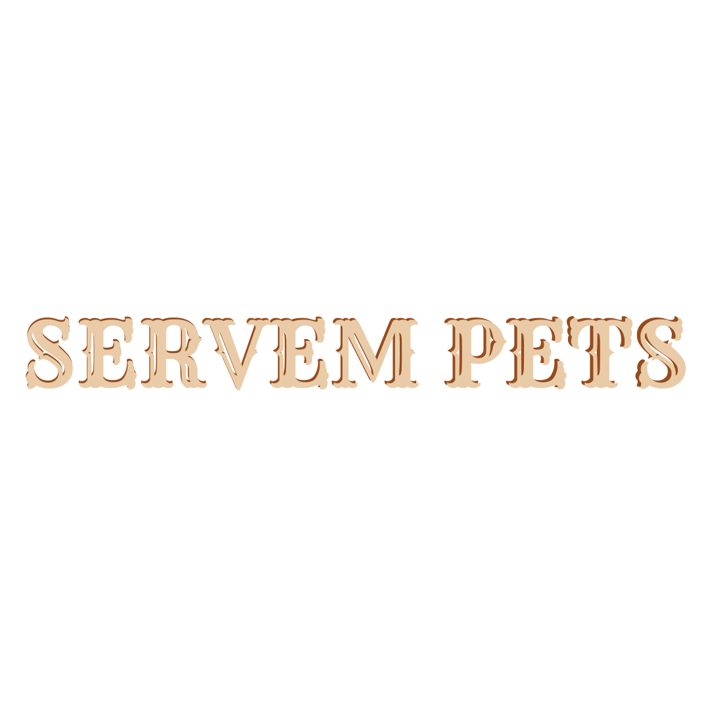

  

<h3>Hello! Welcome to Servem Pets!</h3>

Servem Pets is a revolutionary platform that simplifies the search for trustworthy pet caregivers. As producing academic work can be a sensitive time in students' lives, Servem Pets seeks to alleviate pet owners' concerns regarding the safety and well-being of their furry companions during periods of absence. Our goal is to provide a smooth and transparent experience, allowing users to focus on what really matters: the love and happiness of their pets. With Servem Pets, finding the perfect caregiver for your pet has never been easier and more reliable.

<h4>Discover why Servem Pets stands out as the preferred choice for pet owners:</h4>

* Intuitive interface: Our platform offers an intuitive and user-friendly experience, making it easy to find trustworthy caregivers for your pets.
* Expanded network of caregivers: We connect pet owners with a wide network of qualified and dedicated caregivers, ensuring that your pets receive the best possible care.
* Commitment to animal welfare: Our goal is to promote the well-being and happiness of pets, ensuring that each pet is cared for with love and dedication.

<h4>Want to get in touch?</h4>

The official communication channel for Servem Pets is Instagram: [Servem Pets](https://www.instagram.com/servem_pets/).

  

